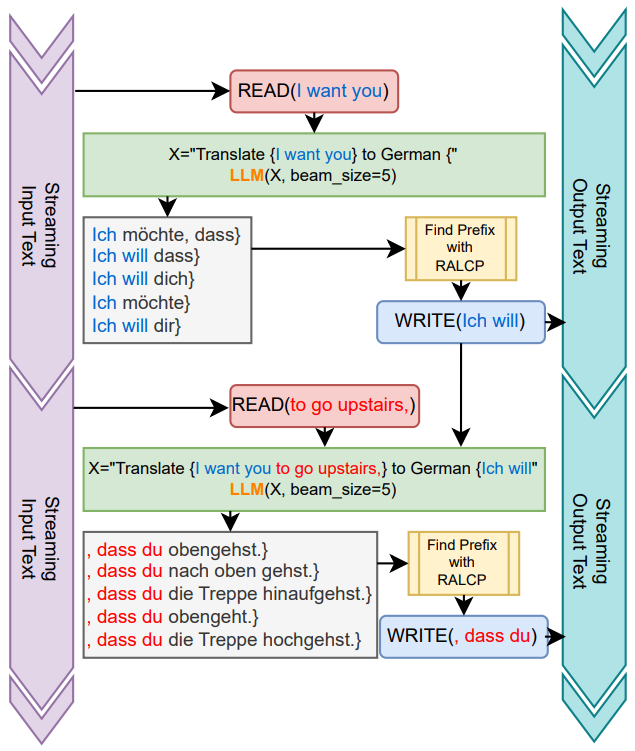
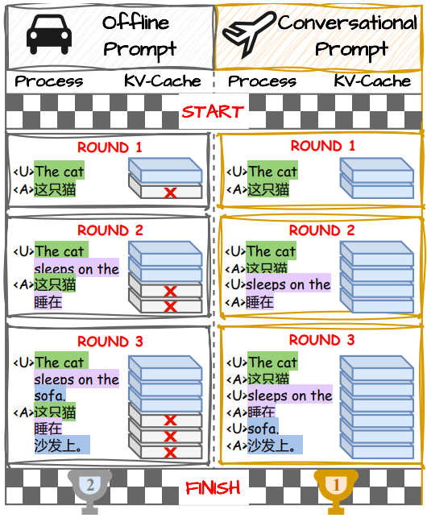

# Simultaneous Machine Translation with Large Language Models (Offline & Conversational Prompts)

> **Official code for**:
>
> - **[Simultaneous Machine Translation with Large Language Models](https://arxiv.org/abs/2309.06706)**  
> - **[Conversational SimulMT: Efficient Simultaneous Translation with Large Language Models](https://arxiv.org/abs/2402.10552)**

---

## 🌍 Overview

This repository implements two ways to turn a general LLM into a **simultaneous machine translation (SimulMT)** system:

1. **Offline-prompt SimulMT**  
   - Treats each step as a *fresh offline translation* call with partial source and partial target.
   - Uses **incremental decoding + (Relaxed) Longest Common Prefix (RALCP)** over beam search to decide what to commit.
   - Corresponds to the paper:  
     **“Simultaneous Machine Translation with Large Language Models”** (ALTA 2024 / arXiv:2309.06706).

2. **Conversational-prompt SimulMT**  
   - Recasts SimulMT as a **multi-turn conversation** between a `User` (source stream) and an `Assistant` (target stream).
   - Preserves **KV cache re-use**, making LLM-based SimulMT much more efficient in wall-clock time.
   - Corresponds to the paper:  
     **“Conversational SimulMT: Efficient Simultaneous Translation with Large Language Models”** (IWSLT 2025 / arXiv:2402.10552).

Both methods share the same high-level ideas:

- Minimal or no architectural change to the LLM (LoRA SFT).
- A **read-n** policy for source token acquisition.
- **Incremental decoding** with (R)ALCP to decide the committed target prefix.
- Evaluation in terms of **translation quality** (BLEU / COMET) and **latency** (AL, LAAL, AP, DAL, TWT, etc.).

**Offline prompt** focuses on **whether LLMs can do SimulMT well at all** (quality, robustness, data efficiency).  
**Conversational prompt** focuses on **making LLM-based SimulMT *efficient*** while preserving quality.

<p align="center">
  
| Offline Prompt + RALCP | Conversational Prompt |
|:----------------------:|:---------------------:|
|  |  |

</p>

---

## 📁 Repository Structure

```text
.
|--- README.md
|--- LICENSE
|--- dataset/              # Place your datasets here (see below)
|--- src
|   |--- data_curation     # Conversational trajectory construction (second paper)
|   |   |--- labse_filter.py
|   |   |--- generate_trajectory.py
|   |   |--- get_alignment.py
|   |--- train
|   |   |--- sft_conv_prompt.py     # SFT for conversational prompt models
|   |   |--- sft_offline_prompt.py  # SFT for offline prompt models
|   |--- eval
|   |   |--- eval_offline_prompt.py # Evaluation entry for offline prompt
|   |   |--- eval_conv_prompt.py    # Evaluation entry for conversational prompt
|   |   |--- simul_evaluator.py     # Shared SimulMT evaluation utilities
|--- scripts
|   |--- data_curation
|   |   |--- txt_to_json.sh         # TXT -> JSON helper
|   |   |--- labse_filter.sh        # LabSE-based filtering (optional)
|   |   |--- generate_trajectory.sh # Build conversational trajectories
|   |--- train
|   |   |--- run_train.sh           # Main training launcher (offline/conv)
|   |--- eval
|   |   |--- eval_sbatch.sh         # Slurm eval wrapper (per prompt type)
|   |   |--- run_eval.sh            # Batch evaluation launcher
|--- tools/
|   |--- fast_align/                # (Expected) location of fast_align binaries
````

> **Note:** `src/data_curation` is only used for **conversational-prompt** trajectories (second paper).
> The **prefix data construction for offline-prompt SFT is not included** here.

---

## 🔧 Installation

We assume a standard Python + GPU setup with HuggingFace + Accelerate. After we add `requirements.txt`, installation will look like:

```bash
git clone <this-repo-url>
cd <this-repo>

# Create env (optional)
conda create -n simulmt python=3.10
conda activate simulmt

# Install dependencies
pip install -r requirements.txt

# (Optional) setup wandb if you want logging
export WANDB_API_KEY=...
```

You will also need:

* Access to the base LLM(s) (e.g. `meta-llama/Llama-2-7b-chat-hf`, Llama 3, Qwen2.5, etc.).
* A working installation of **fast_align** for conversational trajectory generation:

  * Expected at `tools/fast_align/` (see `scripts/data_curation/generate_trajectory.sh`).

---

## 📚 Data Preparation

We support the following datasets (as in the papers):

* **WMT15 De–En** (`wmt15_deen`)
* **MUST-C En–Zh** (`mustc_enzh`)
* **IWSLT15 En–Vi** (`iwslt15_envi`)

### 1. Place raw data

Prepare the datasets in standard MT format under `dataset/{dataset_name}/raw/`, e.g.:

```text
dataset/
  wmt15_deen/
    raw/
      train.de
      train.en
      valid.de
      valid.en
      test.de
      test.en
  mustc_enzh/
    raw/
      train.en
      train.zh
      ...
```

No mandatory tokenization is required here; you may decide to apply Moses, etc., on your own.

### 2. (Optional) LabSE filtering

We provide an optional **LabSE-based filter** to reduce noisy sentence pairs before alignment and trajectory generation.

Script: `scripts/data_curation/labse_filter.sh` (simplified view):

```bash
ROOT_DIR=$(cd "$(dirname "${BASH_SOURCE[0]}")/../../" && pwd)
SRC_PATH="${ROOT_DIR}/src"

SRC=de
TGT=en
RAW_DATA_PATH="${ROOT_DIR}/dataset/wmt15_deen/raw/"
OUTPUT_PATH="${ROOT_DIR}/dataset/wmt15_deen/processed/"
mkdir -p ${OUTPUT_PATH}

GPU_COUNT=4
for i in $(seq 0 $((GPU_COUNT-1))); do
    nohup bash -c "python ${SRC_PATH}/data_curation/labse_filter.py \
        --src ${RAW_DATA_PATH}/train.${SRC} \
        --tgt ${RAW_DATA_PATH}/train.${TGT} \
        --output-path ${OUTPUT_PATH} \
        --cuda ${i}:${GPU_COUNT}" > ${i}.log &
done
```

You should:

1. Adjust `SRC`, `TGT`, `RAW_DATA_PATH`, `OUTPUT_PATH`, `GPU_COUNT`.
2. After filtering, merge shards and convert to JSON for training:

```bash
# Example (uncomment in your own script):
# for i in $(seq 0 $((GPU_COUNT-1))); do
#   cat ${OUTPUT_PATH}/${i}.src >> ${OUTPUT_PATH}/train.${SRC}
#   cat ${OUTPUT_PATH}/${i}.tgt >> ${OUTPUT_PATH}/train.${TGT}
# done

bash scripts/data_curation/txt_to_json.sh \
  ${OUTPUT_PATH}/train.${SRC} \
  ${OUTPUT_PATH}/train.${TGT} \
  ${OUTPUT_PATH}/train.json

bash scripts/data_curation/txt_to_json.sh \
  ${RAW_DATA_PATH}/valid.${SRC} \
  ${RAW_DATA_PATH}/valid.${TGT} \
  ${OUTPUT_PATH}/valid.json
```

After this step, you will have:

* `dataset/{dataset_name}/processed/train.json`
* `dataset/{dataset_name}/processed/valid.json`

These JSON files can be used **directly for offline-prompt SFT**.

### 3. Conversational trajectories (for Conversational SimulMT)

To train **conversational-prompt** models, you need **trajectories** that decompose each sentence pair into `(READ, WRITE)` steps.

Script: `scripts/data_curation/generate_trajectory.sh`:

```bash
ROOT_DIR=$(cd "$(dirname "${BASH_SOURCE[0]}")/../../" && pwd)
SRC_PATH="${ROOT_DIR}/src"

SRC=de
TGT=en
dataset_name=wmt15_deen

RAW_DATA_PATH="${ROOT_DIR}/dataset/${dataset_name}/processed/"
OUTPUT_PATH="${ROOT_DIR}/dataset/${dataset_name}/trajectory/"
FASTALIGN_PATH="${ROOT_DIR}/tools/fast_align/"
mkdir -p ${OUTPUT_PATH}

# 1) Generate alignments using fast_align
python ${SRC_PATH}/data_curation/get_alignment.py \
    --file-type json \
    --split all \
    --input-path ${RAW_DATA_PATH} \
    --output-path ${OUTPUT_PATH} \
    --lang ${SRC}-${TGT} \
    --fastalign-path ${FASTALIGN_PATH}

# 2) Generate trajectories for train / valid
python ${SRC_PATH}/data_curation/generate_trajectory.py \
    --src        ${OUTPUT_PATH}/${SRC}-${TGT}.train.${SRC} \
    --tgt        ${OUTPUT_PATH}/${SRC}-${TGT}.train.${TGT} \
    --alignment  ${OUTPUT_PATH}/alignment.nontok.train.${SRC}-${TGT} \
    --forward    ${OUTPUT_PATH}/forward.nontok.train.${SRC}-${TGT} \
    --reverse    ${OUTPUT_PATH}/reverse.nontok.train.${SRC}-${TGT} \
    --output         ${OUTPUT_PATH}/${SRC}-${TGT}.train.txt \
    --output-pickle  ${OUTPUT_PATH}/train_all.pkl \
    --src-lang ${SRC} --tgt-lang ${TGT}

python ${SRC_PATH}/data_curation/generate_trajectory.py \
    --src        ${OUTPUT_PATH}/${SRC}-${TGT}.valid.${SRC} \
    --tgt        ${OUTPUT_PATH}/${SRC}-${TGT}.valid.${TGT} \
    --alignment  ${OUTPUT_PATH}/alignment.nontok.valid.${SRC}-${TGT} \
    --output         ${OUTPUT_PATH}/${SRC}-${TGT}.valid.txt \
    --output-pickle  ${OUTPUT_PATH}/valid_all.pkl \
    --src-lang ${SRC} --tgt-lang ${TGT}
```

You should change:

* `SRC`, `TGT` (e.g., `en`, `zh`, `vi`)
* `dataset_name` (e.g., `mustc_enzh`, `iwslt15_envi`)
* `FASTALIGN_PATH` to your own fast_align installation.

After this, you will have data under:

```text
dataset/{dataset_name}/trajectory/
  train_all.pkl
  valid_all.pkl
  {src}-{tgt}.train.txt
  {src}-{tgt}.valid.txt
  ...
```

These are used by **`sft_conv_prompt.py`**.

---

## 🧠 Training

We provide a unified training script: `scripts/train/run_train.sh`.
You can toggle between **offline** vs **conversational** prompt training via `prompt_type`.

```bash
bash scripts/train/run_train.sh
```

Key parts of `run_train.sh` (simplified):

```bash
export WANDB_PROJECT="ConvSimulMT"

ROOT_PATH=$(cd "$(dirname "${BASH_SOURCE[0]}")/../../../" && pwd)
SRC_PATH="${ROOT_PATH}/src"
DATA_PATH="${ROOT_PATH}/dataset/"
CKPT_PATH="${ROOT_PATH}/ckpt/"
ACCELERATE_CONFIG_FILE=~/.cache/huggingface/accelerate/a100_config.yaml

# Language pair
src=en          # or de, en (for other directions)
tgt=zh          # or en, vi
src_lang=English
tgt_lang=Chinese

# Dataset
dataset_name=mustc_enzh    # or wmt15_deen, iwslt15_envi

# Prompt type: choose between 'offline' and 'conv'
prompt_type="conv"
# prompt_type="offline"

# Base model
model_name="meta-llama/Llama-2-7b-chat-hf"
model_short_name=l27
sp_map="llama2"            # special token map (llama2 / llama3 / qwen)

ckpt_name="${model_short_name}_${dataset_name}_${prompt_type}_prompt"
ckpt_path=${CKPT_PATH}/${ckpt_name}/

trajectory_args=""
detokenizer_args=""
bin_file=${SRC_PATH}/train/sft_offline_prompt.py
data_dir=${DATA_PATH}/${dataset_name}/processed/

if [ "${prompt_type}" == "conv" ]; then
    bin_file=${SRC_PATH}/train/sft_conv_prompt.py
    trajectory_args="--use_sent_boundary --use_offset --use_merge"
    data_dir=${DATA_PATH}/${dataset_name}/trajectory/
    if [ "${tgt_lang}" == "Chinese" ]; then
        detokenizer_args="--src_detokenizer bpe --tgt_detokenizer bpe"
    fi
fi

epoch=1

PYTHONPATH=$SRC_PATH TOKENIZERS_PARALLELISM=true \
accelerate launch --config_file $ACCELERATE_CONFIG_FILE $bin_file \
 --data_path ${data_dir} \
 --model_name $model_name \
 --epochs $epoch \
 --quant \
 --fa2 \
 --gradient_checkpointing \
 --source_lang ${src_lang} \
 --target_lang ${tgt_lang} \
 --special_token_map ${sp_map} \
 --job_name ${ckpt_name} \
 --max_seq_length 1024 \
 --save_on steps \
 --save_steps 5000 \
 --output_path $ckpt_path \
 --bsz 16 --grad_accum 2 \
 ${detokenizer_args} ${trajectory_args}
```

### What you need to customize

* **Language & dataset**

  * `src`, `tgt`, `src_lang`, `tgt_lang`
  * `dataset_name` ∈ {`mustc_enzh`, `wmt15_deen`, `iwslt15_envi`}
* **Prompt type**

  * `prompt_type="offline"` → offline-prompt models (first paper).
  * `prompt_type="conv"` → conversational-prompt models (second paper).
* **Model**

  * `model_name` (e.g., Llama 2 / Llama 3 / Qwen2.5)
  * `model_short_name`, `sp_map` (used for logging & token maps).
* **Accelerate config**

  * `ACCELERATE_CONFIG_FILE` to match your hardware.

Checkpoints are saved to:

```text
ckpt/{model_short_name}_{dataset_name}_{prompt_type}_prompt/
```

---

## 📊 Evaluation

Evaluation is driven by `scripts/eval/run_eval.sh`, which in turn submits Slurm jobs.

```bash
bash scripts/eval/run_eval.sh
```

Key parts (simplified):

```bash
ROOT_PATH=$(cd "$(dirname "${BASH_SOURCE[0]}")/../../../" && pwd)
SRC_PATH="${ROOT_PATH}/src"
DATA_PATH="${ROOT_PATH}/dataset"
CKPT_PATH="${ROOT_PATH}/ckpt"

# Language pair
src=en
tgt=zh
src_lang=English
tgt_lang=Chinese

# Dataset
dataset_name=mustc_enzh
data_dir=${DATA_PATH}/${dataset_name}/

# Prompt type: conv or offline
prompt_type="conv"
# prompt_type="offline"

# Model + checkpoint
model_name="meta-llama/Llama-2-7b-chat-hf"
model_short_name=l27
sp_map="llama2"

ckpt_name="${model_short_name}_${dataset_name}_${prompt_type}_prompt"
ckpt=${CKPT_PATH}/${ckpt_name}/

submit_job_script=${SCRIPT_PATH}/submit_infer_job.sh
common_sbatch_script=${SCRIPT_PATH}/eval/${prompt_type}/eval_sbatch.sh
```

### Running with RALCP vs. without

The script loops over multiple **read-n** values and beam sizes to compare:

* **With RALCP**: `beam > 1`, `acr` (agreement ratio) used.
* **Without RALCP**: `beam = 1`, `acr` ignored (greedy). (Only models trained with conversational prompt support this.)

Example (from `run_eval.sh`):

```bash
# With RALCP
n=(3 5 7 9 11 13 15 999)
beam=5
acr=0.5
for n in ${n[@]}; do
    sbatch -J ${model_short_name}-${lang_pair}-${n}-${beam}-${acr} \
      ${submit_job_script} ${common_sbatch_script} \
      -P ${prompt_type} -d ${dataset_name} -j ${ckpt_name} \
      -n ${n} -b ${beam} -a ${acr} \
      -D ${data_dir} -l ${lang_pair} \
      -s ${src_lang} -t ${tgt_lang} \
      -m ${model_name} -c ${ckpt} -p ${sp_map}
done

# Without RALCP (beam=1)
n=(3 5 7 9 11 13 15 999)
beam=1
acr=0.5
...
```

> The scripts assume a **Slurm-based cluster**.
> If you do not use Slurm, you can call the Python entry points directly:
>
> * `src/eval/eval_offline_prompt.py`
> * `src/eval/eval_conv_prompt.py`
>   using arguments modeled after the sbatch scripts.

### Outputs

For each evaluation run, we generate three main output files (paths depend on your config):

1. **`results.json`**
   A list of dictionaries, one per test instance, e.g.:

   ```json
   {
     "src":  "source sentence",
     "tgt":  "reference translation",
     "hyp":  "model hypothesis",
     "rw":   [0, 0, 1, 1, 0, 1, ...],  // 0=READ, 1=WRITE per token
     "time": 0.1234                     // wall time for this instance
   }
   ```

2. **`scores.csv`**
   Aggregated metrics across the test set, including:

   * **Translation quality**: `BLEU`, `COMET`, …
   * **Latency metrics**: `AL`, `LAAL`, `AP`, `DAL`, `TWT` (token wall time)
   * (Potentially more metrics depending on your configuration.)

3. **`comet_instance.txt`**
   Contains COMET scores for each instance, useful for detailed analysis.


---

## ✨ Summary of What Each Part Implements

* **Offline-prompt SimulMT (first paper)**

  * `src/train/sft_offline_prompt.py`

    * SFT on JSON bitext (`processed/`), with standard instruction-style translation prompts.
  * `src/eval/eval_offline_prompt.py`

    * Implements **incremental decoding + (R)ALCP** over offline-style prompts.

* **Conversational SimulMT (second paper)**

  * `src/data_curation/get_alignment.py`, `generate_trajectory.py`

    * Build monotonic dependency graphs and `(READ, WRITE)` trajectories from sentence pairs.
  * `src/train/sft_conv_prompt.py`

    * SFT on conversational trajectories: multi-turn `<User, Assistant>` dialogues.
  * `src/eval/eval_conv_prompt.py`

    * SimulMT decoding with conversational prompts, sharing the same evaluation backend (`simul_evaluator.py`).

---

## 📖 Citation

If you find this repo useful, please cite our [paper#1](https://arxiv.org/abs/2309.06706) and [paper#2](https://arxiv.org/abs/2402.10552):
```bibtex
@misc{wang2024simultaneousmachinetranslationlarge,
      title        = {Simultaneous Machine Translation with Large Language Models},
      author       = {Minghan Wang and Jinming Zhao and Thuy-Trang Vu and Fatemeh Shiri and
                      Ehsan Shareghi and Gholamreza Haffari},
      year         = {2024},
      eprint       = {2309.06706},
      archivePrefix= {arXiv},
      primaryClass = {cs.CL},
      url          = {https://arxiv.org/abs/2309.06706},
}
```

```bibtex
@misc{wang2024conversationalsimulmtefficientsimultaneous,
      title        = {Conversational SimulMT: Efficient Simultaneous Translation with Large Language Models},
      author       = {Minghan Wang and Thuy-Trang Vu and Yuxia Wang and
                      Ehsan Shareghi and Gholamreza Haffari},
      year         = {2024},
      eprint       = {2402.10552},
      archivePrefix= {arXiv},
      primaryClass = {cs.CL},
      url          = {https://arxiv.org/abs/2402.10552},
}
```